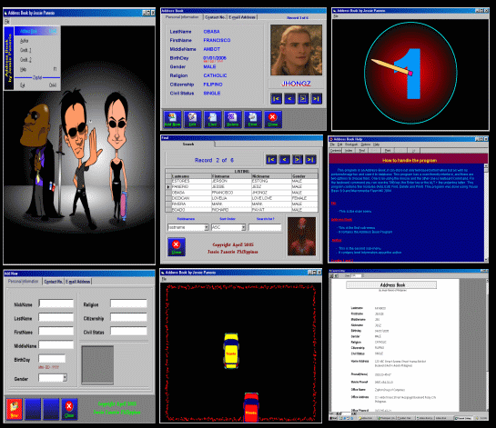



## Unique Address Book 2006 Updated Version

### Description

A very user-friendly address book. saves text and image/photo in database.
 
### More Info
 

             |
---                |---
**Submitted On**   |2005-04-14 22:17:40
**By**             |[Jessie Panerio](https://github.com/Planet-Source-Code/PSCIndex/blob/master/ByAuthor/jessie-panerio.md)
**Level**          |Beginner
**User Rating**    |5.0 (15 globes from 3 users)
**Compatibility**  |VB 3\.0, VB 4\.0 \(16\-bit\), VB 4\.0 \(32\-bit\), VB 5\.0, VB 6\.0, VBA MS Access
**Category**       |[Complete Applications](https://github.com/Planet-Source-Code/PSCIndex/blob/master/ByCategory/complete-applications__1-27.md)
**World**          |[Visual Basic](https://github.com/Planet-Source-Code/PSCIndex/blob/master/ByWorld/visual-basic.md)
**Archive File**   |[Unique\_Add1876924152005\.zip](https://github.com/Planet-Source-Code/jessie-panerio-unique-address-book-2006-updated-version__1-60014/archive/master.zip)

